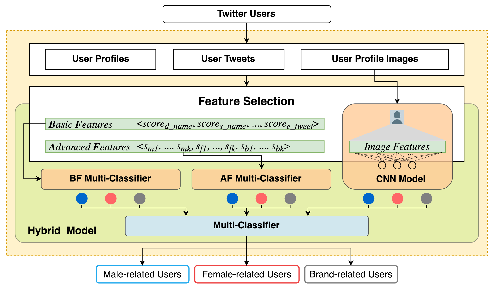
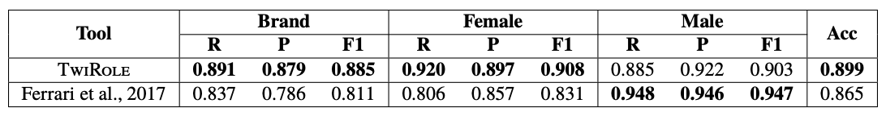
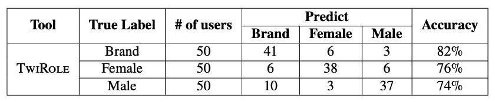

# TwiRole: A Hybrid Model for Role-related User Classification on Twitter

We publish a pre-trained version of TwiRole for role-related user classification on Twitter. The model can automatically crawl a user's profile, profile image and recent tweets, and classify a Twitter user into 📣 ***Brand***, 👚 ***Female*** or  👔 ***Male***, which is an aid to user-related research on Twitter. If TwiRole is helpful for your research, ⭐ it!

## Getting Started

### Prerequisites

* Python 2.7 (Anaconda recommended)

### Installation

Clone this repo on your local machine

```
git clone https://github.com/liuqingli/TwiRole.git
```

Install essential libraries

```
cd TwiRole
pip install -r requirements.txt
```

Install two NLTK packages (Run Python 2.7)

```
>>> import nltk
>>> nltk.download('stopwords')
>>> nltk.download('wordnet')
```

Set up Twarc API key and secret (Please refer to [Twarc](https://github.com/DocNow/twarc) for more details)

```
twarc configure
```

```
consumer key: ***
consumer secret: ***

Please log into Twitter and visit this URL in your browser: https://api.twitter.com/oauth/authorize?oauth_token=***
After you have authorized the application please enter the displayed PIN: ***

✨ ✨ ✨  Happy twarcing! ✨ ✨ ✨
```

## First Classification Task 

TwiRole can detect a single user or multiple users (The screen names of users should be saved in a CSV file line by line). The output contains the final label and the probability of each role. 

In the first run, torch model will be automatically downloaded. User files will be saved in "./user" 

### A Single User

```
python user_classifier.py -u [screen_name]
```
Example:

```
python user_classifier.py -u BBC
Task 1: BBC  =>  Brand   [Male: 20.0%, Female: 9.5%, Brand: 70.5%]
```

### Multiple Users

```
python user_classifier.py -f [CSV File]
```

## Citation

If you apply our model in a scientific publication, we would appreciate citations to the following [paper](https://arxiv.org/abs/1811.10202) on Arxiv:

```
@misc{Li2018TwiRole,
Author = {Liuqing Li, Ziqian Song, Xuan Zhang and Edward A. Fox},
Title = {A Hybrid Model for Role-related User Classification on Twitter},
Year = {2018},
Eprint = {arXiv:1811.10202},
}
```

Or you can also use the bibtex below to cite this repository:

```
@misc{Li2018PreTwiRole,
title={Pre-trained TwiRole for User Classification on Twitter},
author={Liuqing Li, Ziqian Song, Xuan Zhang and Edward A. Fox},
year={2018},
publisher={Github},
journal={GitHub repository},
howpublished={\url{https://github.com/liuqingli/TwiRole}},
}
``` 

## Details

### Model Architecture



### Evaluation

First, we compare TwiRole with Ferrari et al.'s workd on the same Kaggle dataset, since they also categorized Twitter users into Brand, Female, and Male. The overall accuracy (***Acc = 0.899***) of TwiRole is higher than with Ferrari et al.'s approach (***Acc = 0.865***), and our results are more balanced across   different roles.



Second, we use TwiRole to detect the roles of users in another tweet collection, randomly choose 50 user in each class and manually check the roles of users by browsing their Twitter pages. The overall accuracy is about 77%.



## Notes

TwiRole focuses on a user's rich information for prediction but might not best describe the role of a user. As a result, it can effectively support user-related research at the group level, but individual research is not recommended. 

## Acknowledgments

* GETAR project supported by the National Science Foundation under Grant No. IIS-1619028
* Twitter user classification [dataset](https://www.kaggle.com/crowdflower/twitter-user-gender-classification) on Kaggle for training and testing
